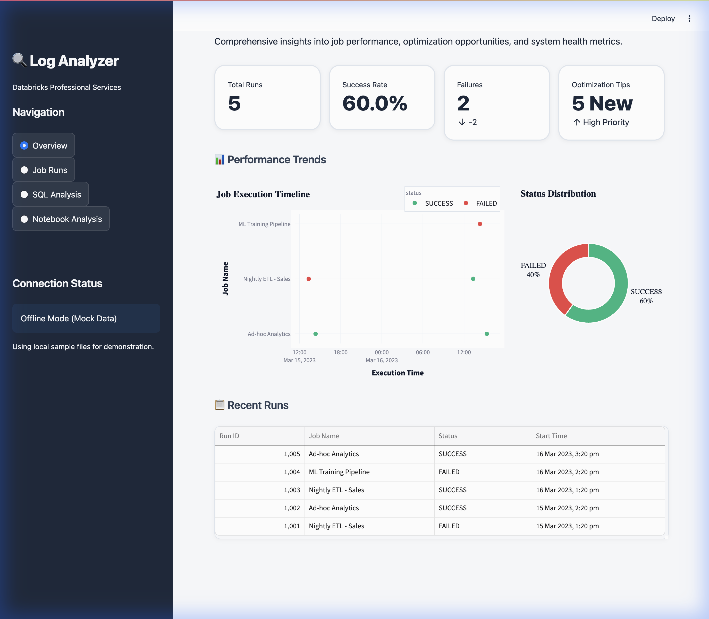
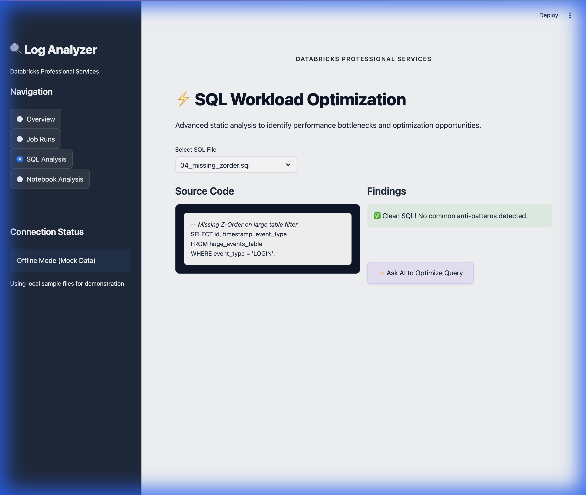
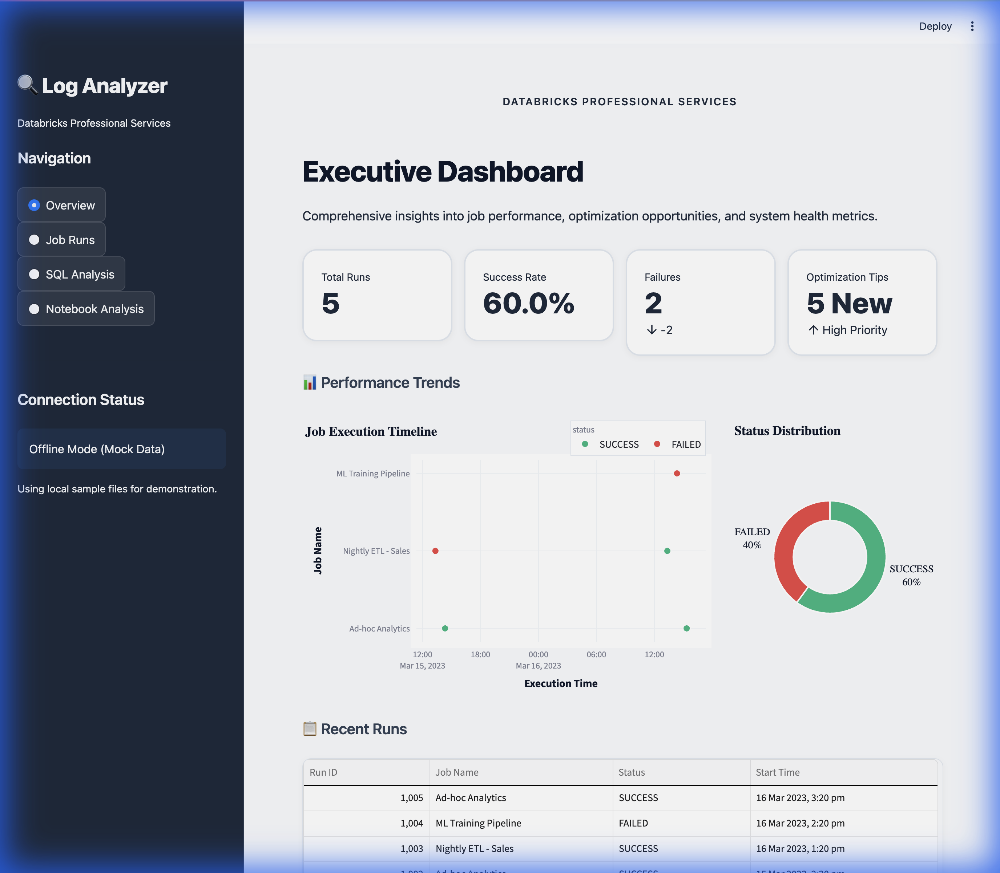

# Databricks PS Log Analyzer

**Automated Root Cause Analysis & Optimization for Databricks Workloads**



## 🚀 Overview

Consultants often lose hours triaging logs and query failures. This tool automates the first-pass root cause analysis by:
1.  **Parsing Logs**: Instantly identifying error types and stack traces.
2.  **Analyzing SQL**: Detecting common anti-patterns (Cartesian joins, full table scans).
3.  **AI Recommendations**: Using local LLMs to suggest fixes and optimizations.

## 📊 Interactive Dashboard

The dashboard provides a modern, accessible interface for analyzing Databricks workloads with WCAG AA compliant design and full responsive support for desktop, tablet, and mobile devices.

### Executive Dashboard
Get a bird's-eye view of job performance with:
- **Real-time Metrics**: Success rates, failure counts, and optimization opportunities
- **Performance Trends**: Visual timeline of job executions and status distribution
- **Quick Insights**: Identify problematic runs at a glance


### SQL Workload Optimization
Static analysis to catch performance issues before they impact production:
- **Anti-pattern Detection**: Identifies `SELECT *`, missing filters, implicit cross joins
- **Query Optimization**: AI-powered suggestions for query improvements
- **Side-by-side Review**: View source code alongside findings



### Job Run Analysis
Deep dive into specific job failures with AI-assisted root cause analysis:
- **Error Classification**: Automatically categorizes failure types
- **Stack Trace Analysis**: AI-powered interpretation of complex Java/Spark errors
- **Actionable Recommendations**: Concrete next steps for remediation



## 💼 Value for Professional Services Teams

### Time Savings
- **Reduce Triage Time**: What took 2-3 hours now takes 10 minutes
- **Faster Client Response**: Provide initial findings during the discovery call
- **Parallel Analysis**: Analyze multiple workloads simultaneously

### Quality & Consistency
- **Standardized Checks**: Every analysis follows the same comprehensive checklist
- **No Missed Patterns**: Automated detection catches issues manual review might miss
- **Documentation**: Export-ready findings for client deliverables

### Client Experience
- **Visual Dashboards**: Professional, executive-friendly presentation
- **Instant Insights**: Provide value in the first engagement meeting
- **Educational Tool**: Help clients understand common pitfalls

### Common Use Cases
1. **Health Checks**: Rapid assessment of new client environments
2. **Migration Validation**: Ensure optimized queries post-migration
3. **Performance Troubleshooting**: Quick identification of bottlenecks
4. **Best Practice Reviews**: Validate code quality across notebooks

## 🛠️ Setup

1.  **Create Virtual Environment**:
    ```bash
    python3 -m venv venv
    source venv/bin/activate
    ```

2.  **Install Dependencies**:
    ```bash
    pip install -r requirements.txt
    ```

3.  **Configure Environment**:
    Copy `.env.example` to `.env` and add your Databricks credentials (optional for mock mode).
    ```bash
    cp .env.example .env
    ```

## 📊 Running the Dashboard

Launch the interactive analysis dashboard:

```bash
streamlit run src/dashboard.py
```

## 💻 CLI Usage

Run analysis from the command line:

```bash
# Run on local sample data
python src/run_analysis.py --local-sample

# Run on latest Databricks jobs (requires .env)
python src/run_analysis.py --latest
```

## 🧠 How It Works

-   **Log Parser**: Scans JSON output from Databricks Jobs API for failure states and spill-to-disk metrics.
-   **SQL Rules**: Uses static analysis to catch `SELECT *`, missing `WHERE` clauses, and cross joins.
-   **AI Engine**: Uses `distilgpt2` (running locally) to generate human-readable summaries of complex Java/Spark stack traces.

## 🔮 Future Roadmap

-   Integration with Databricks Repos for direct code fixes.
-   Auto-generation of Pull Requests with suggested optimizations.
-   Support for more advanced LLMs (Llama 2, Mistral) for deeper code analysis.
