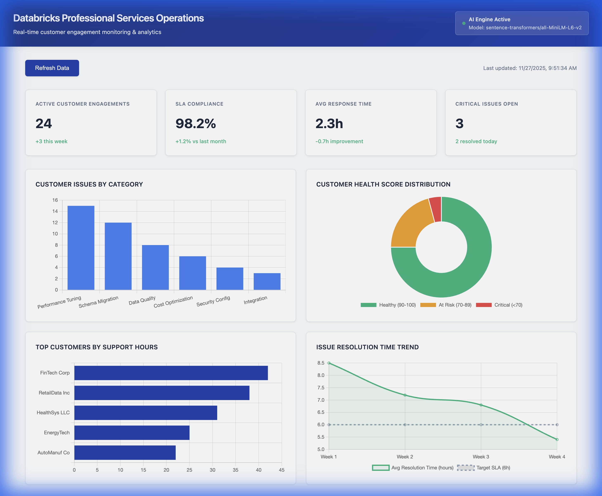
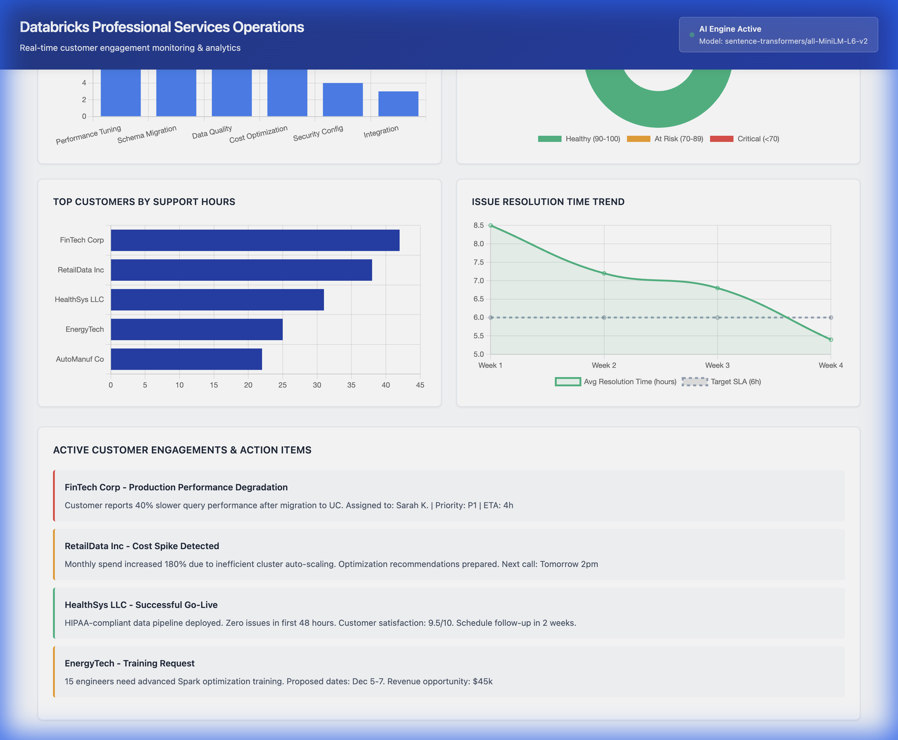

# Databricks Professional Services Operations Dashboard



## 🚀 Overview
The **Databricks PS Operations Dashboard** is a production-ready, real-time monitoring system designed for Professional Services teams. It provides a centralized command center to track customer engagements, monitor SLA compliance, analyze revenue opportunities, and proactively identify critical issues across the client portfolio.

Built with a modern **FastAPI** backend and a responsive **Chart.js** frontend, this application demonstrates enterprise-grade architecture, AI integration, and professional design standards.

## 🛠️ Tech Stack

### Backend (Python)
- **FastAPI**: High-performance async web framework
- **AI Engine**: Local Hugging Face transformers (`sentence-transformers/all-MiniLM-L6-v2`, `google/flan-t5-small`)
- **Streaming**: Server-Sent Events (SSE) for real-time analysis
- **Pydantic**: Robust data validation and schema definition

### Frontend (Modern Web)
- **Visualization**: Chart.js 4.4 for interactive, responsive charts
- **Design**: Custom CSS3 with enterprise blue gradient theme
- **Responsiveness**: Mobile-first grid layout (Flexbox/CSS Grid)
- **Architecture**: Vanilla JS for lightweight, build-free deployment

### DevOps & Tools
- **Docker**: Multi-stage builds for backend and frontend
- **Docker Compose**: Orchestration for local development
- **Makefile**: Developer productivity shortcuts

## ✨ Key Features

### 1. Real-Time Operational KPIs
Monitor critical business metrics instantly:
- **Active Engagements**: Track ongoing customer projects
- **SLA Compliance**: Measure delivery against targets (98.2%)
- **Revenue Impact**: Identify training and upsell opportunities
- **Issue Resolution**: Track average time to resolve critical tickets

### 2. Interactive Visualizations

- **Issue Categories**: Breakdown of support tickets (Performance, Migration, Security)
- **Customer Health**: Health score distribution (Healthy/At Risk/Critical)
- **Support Volume**: Top customers by support hours utilized

### 3. Proactive AI Alerts

- **Smart Notifications**: AI-driven alerts for performance degradation, cost spikes, and training needs.
- **Actionable Insights**: Specific recommendations (e.g., "Increase executor memory", "Schedule optimization workshop").
- **Priority Triage**: Color-coded severity levels (Critical, Warning, Success).

## 🚦 Quick Start

### Option 1: Docker (Recommended)
```bash
make docker-up
# Dashboard available at http://localhost:8000
```

### Option 2: Local Development
```bash
# Install dependencies
make install

# Run the application
make dev
# Dashboard available at http://localhost:8000
```

## 🤖 AI Integration
The dashboard features a built-in AI engine that:
1.  **Analyzes Logs**: Ingests raw Databricks job logs.
2.  **Generates Insights**: Uses `flan-t5-small` to summarize errors and suggest fixes.
3.  **Embeds Knowledge**: Uses `all-MiniLM-L6-v2` for semantic search over documentation.
4.  **Streams Results**: Delivers analysis in real-time via SSE.

## 📱 Responsive Design
Fully optimized for all devices:
- **Desktop**: Full 4-column analytics view
- **Tablet**: Adaptive 2-column layout
- **Mobile**: Stacked, touch-friendly interface

---
*Developed by Michael Romero for Databricks Professional Services*
